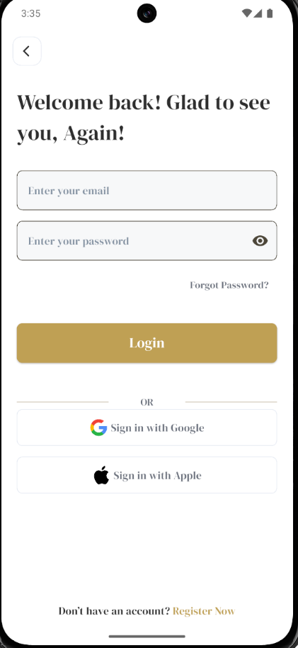

# 📚 Bookia App

Bookia is a modern mobile application designed to make book ordering and account management simple, elegant, and user-friendly.  
The app provides a seamless experience for new and returning users with intuitive authentication flows and a clean design.

---

## 📸 Screenshots

| Welcome | Login | Register |
|---------|-------|----------|
|  |  |  |

---

## ✨ Features

### 🏠 Welcome Screen
- Beautiful splash interface with the **Bookia logo** and tagline: *"Order Your Book Now!"*  
- Clear entry points for users: **Login** or **Register**.  
- Cozy background design that sets the tone for a reading-focused app.

### 🔑 Login Screen
- User-friendly login form with fields for **email** and **password**.  
- Password visibility toggle for convenience.  
- **Forgot Password?** link for quick recovery.  
- Prominent **Login button** styled in gold.  
- Social sign-in options: **Google** and **Apple**.  
- Bottom prompt: *"Don't have an account? Register Now"* with highlighted action.

### 📝 Register Screen
- Clean registration form with fields for **Username**, **Email**, **Password**, and **Confirm Password**.  
- Password visibility toggle for both password fields.  
- Gold-colored **Register button** for account creation.  
- Bottom prompt: *"Already have an account? Login Now"* with highlighted action.

---

## 🚀 Getting Started

1. Clone the repository:
   ```bash
   git clone https://github.com/your-username/bookia_app.git