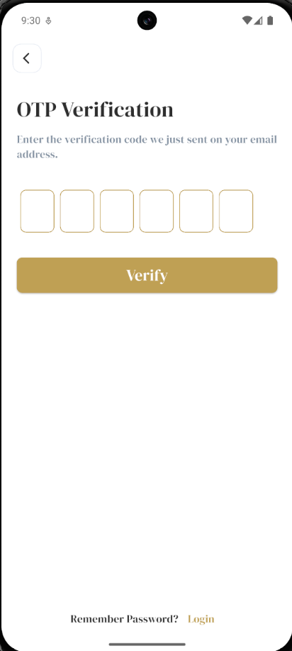
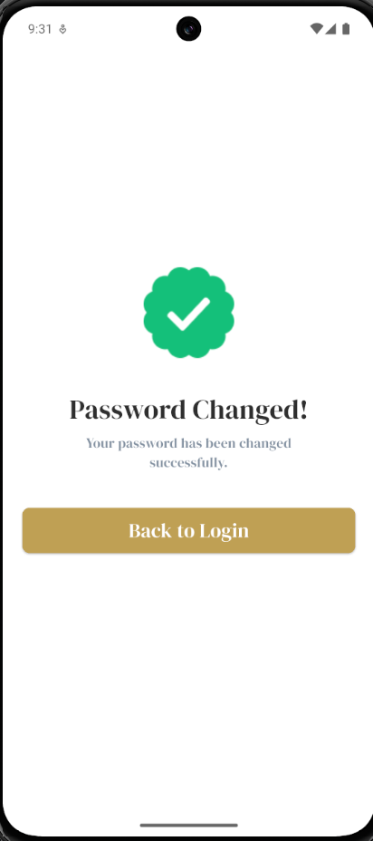
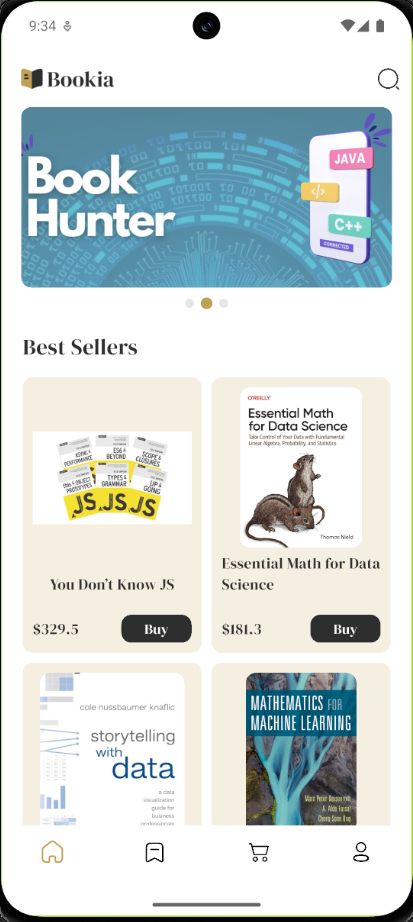
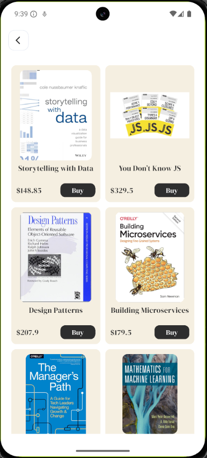
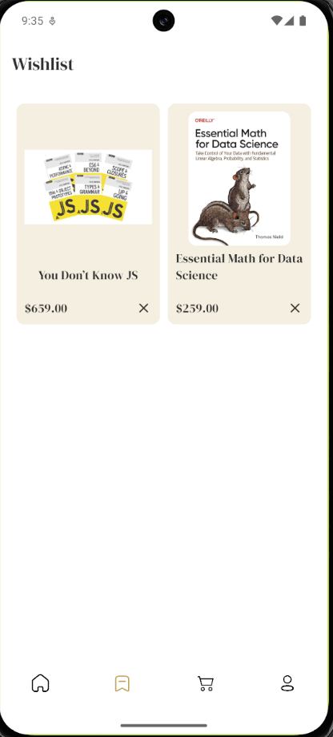

# 📚 Bookia - Your Ultimate Digital Bookstore

Bookia is a modern, feature-rich mobile application built with Flutter, designed for book enthusiasts. It provides a seamless and elegant experience for discovering, searching, and managing favorite books, featuring authentication, a responsive UI, and robust state management.

---

## 📸 App Experience

### 🔐 Authentication Flow
| Welcome | Login | Registration | Forgot Password |
|:---:|:---:|:---:|:---:|
|  |  |  |  |

| OTP Verification | New Password | Success |
|:---:|:---:|:---:|
|  |  |  |

### 🏠 Core Features
| Home Screen | Search & Discovery | Wishlist | Book Details |
|:---:|:---:|:---:|:---:|
|  |  |  |  |

---

## ✨ Key Features

### 🔐 Authentication
*   **Secure Access**: Robust login and registration system.
*   **Password Recovery**: Full flow including "Forgot Password", OTP verification, and password reset.
*   **Intuitive UI**: Smooth forms with input validation and password visibility toggles.
*   **Social Sign-in**: Support for modern authentication methods.

### 🏠 Home & Discovery
*   **Carousel Slider**: Highlights featured books with smooth transitions.
*   **Book Feed**: Browse a wide collection of books with detailed cards.
*   **Categorization**: Discover books organized by interesting categories.

### 🔍 Explore & Search
*   **Advanced Search**: Quickly find books by title or author with a dedicated search interface.
*   **Real-time Results**: Fast and responsive search feedback.

### ❤️ Wishlist Management
*   **Personal Collection**: Keep track of books you want to read.
*   **Offline Support**: Seamless local caching using **SharedPreferences** and **Hive** ensures your wishlist is accessible even without internet.
*   **Dynamic Sync**: Real-time synchronization between the UI and local storage.

---

## 🛠️ Tech Stack & Architecture

### 🚀 Powered By:
*   **Frontend**: [Flutter](https://flutter.dev) (Dart)
*   **State Management**: [Flutter BLoC / Cubit](https://pub.dev/packages/flutter_bloc)
*   **Navigation**: [GoRouter](https://pub.dev/packages/go_router)
*   **Networking**: [Dio](https://pub.dev/packages/dio)
*   **Local Storage**: [Hive](https://pub.dev/packages/hive_ce) & [SharedPreferences](https://pub.dev/packages/shared_preferences)
*   **UI Enhancements**:
    - [Shimmer](https://pub.dev/packages/shimmer) for skeleton loaders.
    - [Lottie](https://pub.dev/packages/lottie) for smooth animations.
    - [SVG](https://pub.dev/packages/flutter_svg) for high-quality scalable icons.
    - [Cached Network Image](https://pub.dev/packages/cached_network_image) for optimized image loading.

### 🏗️ Architecture
The project follows **Clean Architecture** principles to ensure scalability and maintainability:
- **Core**: Shared utilities, theme configurations, and routing.
- **Features**: Modularized logic separated by functionality (Home, Auth, Wishlist, etc.).
- **Data Layer**: Repositories, models, and data providers (API & Local).
- **Presentation Layer**: BloCs/Cubits, pages, and atomic widgets.

---

## 🚀 Getting Started

### Prerequisites
- Flutter SDK (^3.10.4)
- Git

### Installation
1.  **Clone the repository**:
    ```bash
    git clone https://github.com/your-username/bookia.git
    cd bookia
    ```

2.  **Install dependencies**:
    ```bash
    flutter pub get
    ```

3.  **Run the code generator**:
    ```bash
    flutter pub run build_runner build --delete-conflicting-outputs
    ```

4.  **Launch the application**:
    ```bash
    flutter run
    ```

---

## 🎨 UI & Design
Bookia focuses on a premium user experience with:
- **Custom Typography**: Utilizing `DMSerif` for a classic bookstore feel.
- **Micro-animations**: Subtle transitions and Lottie effects.
- **Skeleton Loaders**: Professional loading states using Shimmer.

---

## 🤝 Contribution
Contributions are welcome! Feel free to open issues or submit pull requests.

## 📝 License
This project is open-source. Feel free to use it for learning and reference.